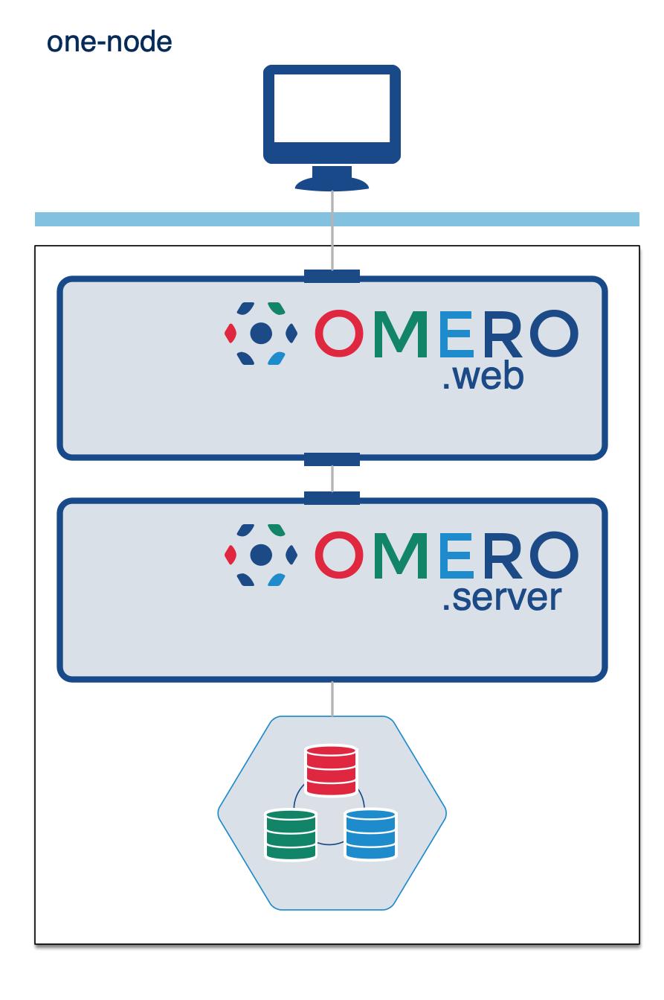
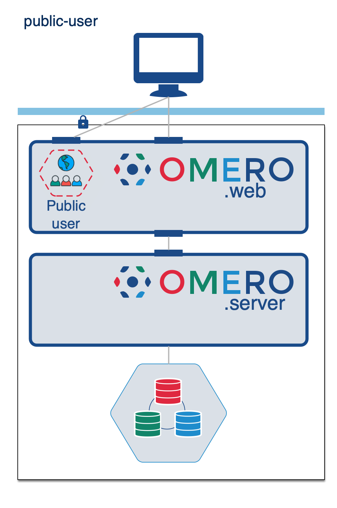
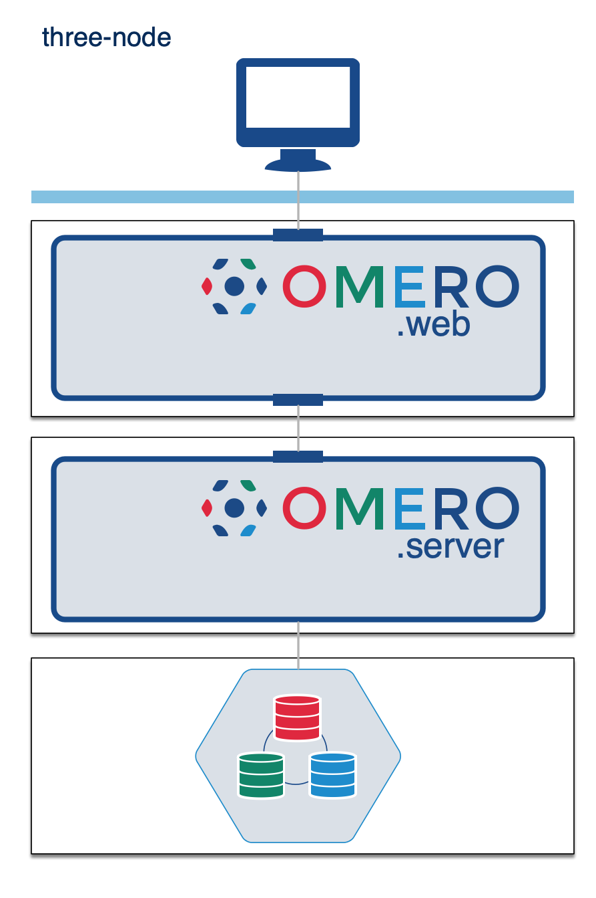

OMERO server examples
=====================

This repository contains example playbooks for installing OMERO with [Ansible](https://www.ansible.com/).
You can copy these and modify them for your own use.

## Quick start

Install the prerequisites:

-   either Ansible: e.g. `pip install ansible`. At the time of writing, the Ansible version was 2.13.2. Other versions of 
    Ansible may work but are not routinely tested by us.
-   or [Docker](https://docs.docker.com/install/) and docker-compose e.g.
    `pip install docker-compose`

Install OMERO.server and OMERO.web using one of the Ansible playbooks and/or 
Docker blueprints:

 * [Basic](#basics) installation: all components on the same node
 * [Public user](#public-user): allow public access to selected data without the need to log in
 * [Three nodes](#three-nodes): use more physical or virtual hardware to scale up your installation
 
### Basics

    cd ansible-example-omero-onenode
    ansible-galaxy install -r requirements.yml
    ansible-playbook playbook.yml

The above diagram represents the most basic OMERO installation with OMERO.web, OMERO.server, and
PostgreSQL all installed on the same physical node. 

### Public user

    cd ansible-role-omero-public-user
    ansible-galaxy install -r requirements.yml
    ansible-playbook playbook.yml

This recreates the configuration documented in the OMERO.web [documentation](https://docs.openmicroscopy.org/latest/omero/sysadmins/public.html)

### Three nodes

    cd ansible-role-omero-three-nodes
    ansible-galaxy install -r requirements.yml
    ansible-playbook playbook.yml

To run a similar configuration in Docker:

    cd docker-example-omero
    docker-compose up

This is an example of installing PostgreSQL, OMERO.server and OMERO.web on separate nodes.
